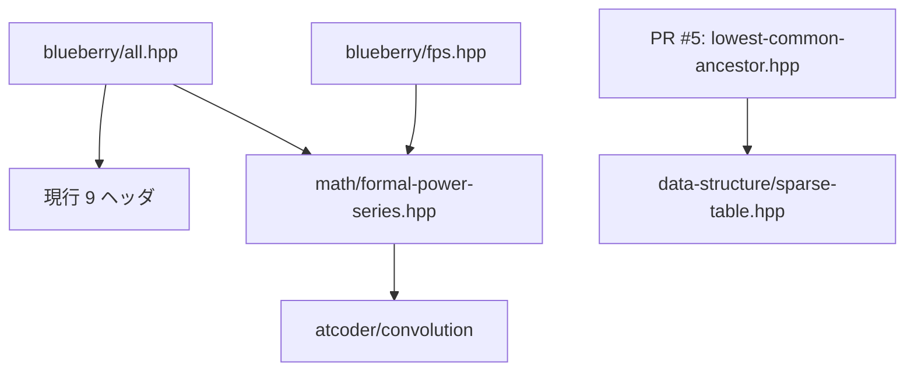

# Blueberry Library audit and roadmap

監査日: 2026-09-13  
基準: `main` (`4448ce540b75dddc34ff40effd9d0c013808d079`)  
open PR: [#5 Add short APIs, RMQ LCA, HLD, and Fastest analysis](https://github.com/blueberry1001/Blueberry-library/pull/5) (`f1efae1ac2225aeeec379e2ee3981f0d2611ff50`)

## 目的と判定基準

この文書は、ライブラリ本体を変更せず、現在の収録物、公開 API、検証状況、依存関係、
性能・正しさの懸念、未実装機能を棚卸ししたものです。優先順位は次の三点を中心に決めます。

1. **短く打てる**: 競技中の定型コードと呼び出しが短く、補完なしでも入力しやすい。
2. **高速**: 漸近計算量だけでなく、allocation、キャッシュ効率、定数倍も同条件で測定できる。
3. **思い出しやすい**: ACL や代表的な競プロライブラリと大きく外れない命名、0-indexed、半開区間 `[l, r)` を使う。

優先度の意味は以下の通りです。

- **High**: 誤答、未定義動作、単体 include 失敗、主要機能の欠落につながる。次の安定版より前に対応する。
- **Medium**: 競技中の使い勝手、検証範囲、実測性能を明確に改善する。
- **Low**: 互換性整理、限定用途、測定後に判断すべき最適化。

## 要約

- `blueberry/` には **18 ヘッダ**ある。内訳は、現行カタログのアルゴリズム 10、互換入口 1、
  umbrella header 1、カタログ外の旧実装 6 である。
- 現行 10 ライブラリは全てドキュメントと Library Checker verify を持つ。ただし verify は主経路中心で、
  全 public API の意味や境界条件を網羅してはいない。
- 旧実装 6 件は全て `blueberry` 名前空間、現行のファイル配置、ドキュメント、verify、`all.hpp` の外にある。
  うち 3 件は通常の単体利用でコンパイルに失敗し、複数件に空状態、所有権、overflow、API 名と実体の不一致がある。
- `RollbackUnionFind` と最短路は新旧の重複実装が存在する。`implicit_treap.hpp` は名前に反して値をキーにした
  ordered treap であり、位置挿入型 implicit treap ではない。
- 現行 API で特に長い `product` / `all_product` / `prefix_sum` / `component_size` / `kth_ancestor` は
  PR #5 が互換 alias を提案済みである。重複実装を避けるため、同 PR の扱いを決めてから追加変更する。
- 最優先の新規領域は、旧 Li Chao Tree の安全な移行、Wavelet Matrix、木クエリ基盤、
  offline dynamic connectivity、文字列・幾何の基礎である。ACL に既にある機能は再実装より利用ガイドを優先する。

## 収録ライブラリと public API

### 現行カタログ

「公式 verify」は、該当ヘッダを使用する `verify/**/*.test.cpp` があることを表します。
「部分」は、主要操作は検証するものの、表に挙げた全 API の性質までは直接検証しないことを表します。

| ヘッダ / ライブラリ | 主な public API | 公式 verify | Library Checker | 所見 |
| --- | --- | --- | --- | --- |
| `data-structure/disjoint-set-union.hpp` / `DisjointSetUnion` | `leader`, `merge`, `same`, `component_size`, `size`, `groups` | 部分 | [`unionfind`](https://judge.yosupo.jp/problem/unionfind) | ACL と重複。`component_size(v)` と全要素数の `size()` が ACL の `size(v)` と異なる |
| `data-structure/fenwick-tree.hpp` / `FenwickTree<T>` | `add`, `prefix_sum`, `sum`, `get`, `lower_bound`, `size` | 部分 | [`point_add_range_sum`](https://judge.yosupo.jp/problem/point_add_range_sum) | vector 構築は O(N)。`lower_bound` の非負前提は文書化済み |
| `data-structure/rollback-union-find.hpp` / `RollbackUnionFind` | `leader`, `merge`, `same`, `component_size`, `components`, `size`, `state`, `snapshot`, `undo`, `rollback` | 部分 | [`persistent_unionfind`](https://judge.yosupo.jp/problem/persistent_unionfind) | rollback DFS で persistent query を処理。`merge` は union by size により最悪 O(log N) と書ける |
| `data-structure/segment-tree.hpp` / `SegmentTree<S, Op>` | constructors, `set`, `get`, `product`, `all_product`, `size` | 部分 | [`point_set_range_composite`](https://judge.yosupo.jp/problem/point_set_range_composite) | ACL と重複し、`max_right` / `min_left` はない。長い操作名は PR #5 で alias 追加済み |
| `data-structure/sparse-table.hpp` / `SparseTable<T, Op>` | constructor, `product`, `size` | 主経路 | [`staticrmq`](https://judge.yosupo.jp/problem/staticrmq) | O(1) query には冪等性が必要。空配列・空区間は非対応 |
| `graph/dijkstra.hpp` / `WeightedEdge`, `WeightedGraph`, `ShortestPathResult`, `dijkstra` | `to`, `cost`, `distance`, `parent`, `infinity`, `path_to` | 部分 | [`shortest_path`](https://judge.yosupo.jp/problem/shortest_path) | 距離加算の overflow は呼出側責任。辺 ID は保持しない |
| `graph/lowest-common-ancestor.hpp` / `LowestCommonAncestor` | constructor, `kth_ancestor`, `lca`, `distance`, `depth` | 部分 | [`lca`](https://judge.yosupo.jp/problem/lca) | doubling、前計算・メモリ O(N log N)。隣接先の範囲検査は PR #5 で追加済み |
| `math/formal-power-series.hpp` / `FormalPowerSeries<Mint>`, `FPS<Mint>` | vector API、`pre`, `rev`, `shrink`, 四則、疎形式四則、shift、`dot`, `eval`, `multiply`, `divide`, `diff`, `integral`, `inv`, `log`, `sqrt`, `sqrt_with`, `exp`, `pow`, `mod_pow` | 部分 | [`inv`](https://judge.yosupo.jp/problem/inv_of_formal_power_series), [`log`](https://judge.yosupo.jp/problem/log_of_formal_power_series), [`exp`](https://judge.yosupo.jp/problem/exp_of_formal_power_series), [`sqrt`](https://judge.yosupo.jp/problem/sqrt_of_formal_power_series), [`pow`](https://judge.yosupo.jp/problem/pow_of_formal_power_series) | 高機能だが未 verify 操作が多い。ACL の内部 NTT API に依存 |
| `math/prime-sieve.hpp` / `PrimeSieve` | constructor, `is_prime`, `primes`, `limit` | 部分 | [`enumerate_primes`](https://judge.yosupo.jp/problem/enumerate_primes) | 素数列挙のみ。最小素因数・素因数分解は未実装 |
| `string/z-algorithm.hpp` / `z_algorithm` | `z_algorithm(sequence)` | 全 API | [`zalgorithm`](https://judge.yosupo.jp/problem/zalgorithm) | ACL と重複する互換実装 |

### 入口・互換ヘッダ

| ヘッダ | 公開内容 | 状態 |
| --- | --- | --- |
| `all.hpp` | 現行 10 ヘッダを全て include | `many_aplusb` で一括コンパイルされる。ただし FPS 経由で ACL が必須になる |
| `fps.hpp` | `FormalPowerSeries`, `modint998244353`, `mint`, `FPS`, `sfps` をグローバルへ導入 | 旧コード互換用。短い一方で global namespace を汚染するため、新規コードでは現行ヘッダを使う |

### カタログ外の旧実装

| ヘッダ / 型 | public API | verify / docs | 主な問題 | 移行候補 |
| --- | --- | --- | --- | --- |
| `ConvexHulltrick.hpp` / `DynamicLiChaoTree` | public `Line`, `Node`, `root`; `add_line`, `add_segment`, `query` の内部版・外部版 | なし / なし | include guard・標準 include・名前空間なし。実際に instantiate すると `swap` / `min` 未宣言。raw `new`、解放なし、コピーで root を共有。ファイル名と型名も不一致 | `data-structure/li-chao-tree.hpp`; [`line_add_get_min`](https://judge.yosupo.jp/problem/line_add_get_min), [`segment_add_get_min`](https://judge.yosupo.jp/problem/segment_add_get_min) |
| `DynamicFenwickTree2D.hpp` / `HashMap`, `DynamicFenwickTree`, `DynamicFenwickTree2D` | 全内部配列・サイズが public; `operator[]`, `find`, `enumerate`, `set_default`, `add`, `sum`, `lower_bound` | なし / なし | 単体 include がコンパイル不能。2D 側は行ごとに raw `new` し解放せず、コピーが同じ BIT を共有。`M` は未使用。`lower_bound` が lookup 中に map を更新する | `data-structure/dynamic-fenwick-tree-2d.hpp`; [`point_add_rectangle_sum`](https://judge.yosupo.jp/problem/point_add_rectangle_sum) |
| `Graph.hpp` / `Graph` | public `g`, `V`, `weighted`, `dist`; `add_edge`, stdin 固定の `init`, `distance`, `isbipartite_graph` | なし / なし | global `using namespace std`、`bits/stdc++.h`、include guard なし。新 `dijkstra.hpp` と重複。重みで BFS / Dijkstra を暗黙選択し、負辺や overflow を防がない。再帰二部グラフ判定は深い入力で stack risk | 機能別に `dijkstra`, `bfs`, `is_bipartite` へ分離。旧型は deprecated wrapper のみにする |
| `RollbackUnionFind.hpp` / `RollbackUnionFind` | public `data`, `history`, `inner_snap`; `unite`, `find`, `same`, `size`, `undo`, `snapshot`, `get_state`, `rollback` | なし / なし | 現行実装との重複かつ API 非互換。単体 include がコンパイル不能。検査なしの `undo()` は空履歴で不正アクセス | 現行 `data-structure/rollback-union-find.hpp` への薄い互換 wrapper |
| `fraction.hpp` / `fraction`; global `__gcd`, `Gcd`, `simplify`, `ll` | constructors, public `num`, `den`, arithmetic/comparison/stream operators, `raw_assign` | なし / なし | include guard・名前空間なし。予約識別子 `__gcd` を定義。分母 0 と narrowing を防がず、内部 `__int128` の結果を `long long` に格納する | 必要性を再評価し、残すなら `math/fraction.hpp` と境界ランダムテストを新規実装 |
| `implicit_treap.hpp` / `Treap` | `insert`, `erase`, `find`, `index`, `rindex`, `count`, `size`, `operator[]`, `query` | なし / なし | 実体は値順 BST で implicit treap ではない。空木の `index` / `operator[]` / `query`、存在しない値の `erase` で null dereference。集約が `op` / `e` を一貫利用せず非可換演算に非対応。raw `new`、解放なし | ordered multiset と implicit treap を別実装に分離。前者は [`predecessor_problem`](https://judge.yosupo.jp/problem/predecessor_problem) で検証 |

## 命名・API 監査

### High

- カタログ外ヘッダを「互換保証済み」に見せない。現状の README は全てを旧互換ヘッダとして扱うように読めるが、
  旧 6 件は現行規約の最低条件を満たしていない。README に experimental / unsafe / deprecated の区分を置く。
- `implicit_treap.hpp` は名称と機能が異なる。安全な移行先ができるまでは新規利用を止める。
- 旧 `RollbackUnionFind` と現行 `RollbackUnionFind` は、include path により同名・別 API になる。
  新実装を唯一の正本にし、旧パスは互換 wrapper または明示的な廃止対象にする。

### Medium

- `SegmentTree::product` / `all_product` と `SparseTable::product` は ACL の `prod` / `all_prod` より長い。
  PR #5 のように短い名前を正本とし、旧名を互換 alias にする。
- `FenwickTree::prefix_sum`、DSU の `component_size`、LCA の `kth_ancestor` は説明的だが頻出する。
  PR #5 は `pref`, `comp_size`, `kth` を提案済み。短縮名を増やしすぎないよう、この一組に固定する。
- `DisjointSetUnion::size()` は要素数、ACL の `dsu::size(v)` は成分サイズで意味が違う。
  `n()` と `size(v)` に寄せる案もあるが破壊的なので、当面は `comp_size(v)` と文書で区別する。
- `WeightedGraph` / `WeightedEdge` / `ShortestPathResult` は一度しか書かない型名なので優先度は低めだが、
  利用例では `using WGraph = ...` を示すと入力部分を短くできる。
- `isbipartite_graph` は `is_bipartite`、`fraction` は `Fraction`、`Gcd` は `gcd` が現行規約に合う。
  ただし旧実装を直接 rename せず、移行先で直す。

### Low

- `FormalPowerSeries` は `FPS<Mint>` alias が既にあり、十分短い。`std::vector` 公開継承により API 面積は大きいが、
  競プロでは `f[i]`, `resize`, iterator が有用なので、変更は性能・誤用データを得てから判断する。
- `LowestCommonAncestor` も構築時のみ長い。将来 `using LCA = LowestCommonAncestor` を加える余地はあるが、
  `lca.lca(u,v)` 自体は短く、先にクエリ機能を揃える。

## 計算量・仕様の明確さ

現行 10 件の文書には、時間・メモリ、区間、前提が概ね揃っている。残る改善点は以下です。

| 優先度 | 対象 | 改善点 |
| --- | --- | --- |
| Medium | Rollback Union Find | `merge` / `leader` / `same` は union by size により **最悪** O(log N)。`merge` の「償却」は不要 |
| Medium | FPS | `N`, 右辺長、畳み込み計算量 `M(N)` の記号が同じ表内で紛らわしい。次数と保持長も区別する |
| Medium | FPS | `sqrt(0)` / `sqrt_with(..., 0)` は他の次数指定 API と違い assertion failure。空を返すのか禁止するのかを統一する |
| Medium | FPS | 疎形式除算で同一次数の重複項、とくに次数 0 が複数ある場合の前提が未定義。正規化するか禁止を明記する |
| Low | FPS `eval` | 文書は「Horner 法相当」だが、実装は `power *= x` の昇順評価。計算量は同じでも説明を実装に合わせる |
| High | 旧 6 件 | 計算量・メモリ・境界・所有権・空入力・期待計算量の定義がない。移行先では現行テンプレートで全項目を書く |

## verify 監査

### 現在の対応

- 15 本の verify がある。内訳は DS 5、Graph 2、Math 6、String 1、umbrella compile 1。
- 現行カタログ 10 件は全て少なくとも 1 本の公式問題を持つ。
- `all.hpp` のテストは全現行ヘッダを同時に読み込むが、個々のヘッダを単独で instantiate するテストではない。
- 旧 6 件はドキュメント登録も verify もなく、`all.hpp` からも到達しない。

### 追加すべき検証

| 優先度 | 対象 | 検証内容 |
| --- | --- | --- |
| High | 全ヘッダ | 1 ヘッダずつ C++20 で include し、代表 API を instantiate。二重 include も確認する |
| High | 旧ヘッダ | 移行完了までは CI の「既知の失敗」一覧に固定し、利用可能と誤認させない |
| High | FPS | 四則、`div_mod`, 疎形式、shift、`dot`, `eval`, factor 操作、微積分、`mod_pow` を愚直実装と random compare |
| Medium | DSU | `leader`, component size, `groups` と空・単頂点ケース |
| Medium | Rollback UF | 同一集合 merge、snapshot 上書き、任意 state への rollback、components の random compare |
| Medium | Fenwick | `prefix_sum`, `get`, `lower_bound`, `n=0`, vector 構築の random compare |
| Medium | Segment Tree | 空区間、`all_product`, 非可換演算、`n=0` |
| Medium | LCA | `kth_ancestor`, `distance`, `depth`, 根変更、path/tree 形状の random compare |
| Medium | Dijkstra | 到達不能、0 重み、平行辺、距離上限直前。overflow を起こさない契約も検査する |
| Low | Prime Sieve / Z | 小さい上限、空列、全同値列の boundary tests |

Library Checker 追加候補は、FPS の一般積・除算、旧 Li Chao、2D Fenwick、ordered set です。
公式問題が API 全体を直接表さない操作は、`many_aplusb` を入口にした独自 random test と分けます。

## include 依存関係

- 現行 `main` では、FPS 以外のカタログヘッダ間に include 依存はない。
- `all.hpp` は FPS も含むため、データ構造だけ使う場合でも外部 ACL が必要になる。
- PR #5 を取り込むと、RMQ LCA のため LCA から Sparse Table への依存が増える。
- 旧 `DynamicFenwickTree2D.hpp` と旧 `RollbackUnionFind.hpp` は必要な標準ヘッダを include していない。
- 旧 Li Chao Tree はテンプレート定義だけなら解析を通るが、利用時に `<algorithm>` と `std::` がないため失敗する。
- `ConvexHulltrick.hpp`, `DynamicFenwickTree2D.hpp`, `Graph.hpp`, `fraction.hpp`, `implicit_treap.hpp` に
  include guard がない。複数経路から読み込むと再定義になる。

`all.hpp` は便利ですが、依存とコンパイル時間を明示するため、将来は次の二択を比較します。

1. `all.hpp` は完全版のままにし、ACL 必須を明記する。
2. 標準ライブラリだけの `core.hpp` と、ACL を含む `all.hpp` を分ける。

## 正しさ・安全性の懸念

### High

- 旧 treap の空木操作と存在しない値の erase は null pointer を辿る。新規利用を止める。
- 旧 2D Fenwick と旧 Rollback Union Find は単体 include でコンパイルできない。
- 旧 Li Chao Tree は代表 API の instantiate でコンパイルできない。
- カタログ外実装は全て公式・random verify がなく、正しさを主張できない。
- 出典 URL や作者コメントだけでライセンス条件が明確でない旧コードがある。
  再実装か、出典・ライセンス・変更点の明示が必要。

### Medium

- Dijkstra は `current_distance + edge.cost` の overflow を内部で防がない。既定 `max()` を infinity にすると、
  有限距離と辺重みの和が型上限を超える入力で未定義動作になり得る。
- FPS `mod_pow(0, modulus)` は常に `{1}` を返し、定数多項式で割る場合の剰余 0 と一致しない。
- FPS 疎形式除算は重複次数を集約しない。入力正規化を契約にするか内部で統合する。
- raw pointer を所有する旧 Li Chao / 2D Fenwick / treap は destructor がなく、コピー時の意味も未定義。
- `fraction` は `__int128` で途中計算しても最終的に `long long` へ narrowing するため、表現範囲外を検出できない。

## 性能上の調査候補

| 優先度 | 対象 | 仮説と測定方針 |
| --- | --- | --- |
| High | FPS | `pre` / `rev` / Newton 反復の一時 vector と NTT 回数が支配的。PR #5 の Fastest 調査を使い、同一 CPU・compiler・flags・case で測る |
| Medium | Li Chao 移行版 | node ごとの `new` は遅く locality も悪い。index-based pool と raw allocation を比較する |
| Medium | 2D Fenwick 移行版 | 行ごとの heap allocation と custom hash の定数倍を、offline 座標圧縮 BIT-of-vectors と比較する |
| Medium | LCA | doubling は query O(log N), memory O(N log N)。PR #5 の RMQ 版も memory O(N log N) なので、必要なら線形メモリ RMQ / HLD と比較する |
| Low | Sparse Table | `vector<vector<T>>` の level 別 allocation と flat buffer を測る。根拠なく複雑な実装へ置換しない |
| Low | Dijkstra | pair heap と専用 node、reserve 可能な隣接表、radix heap は重み制約別に benchmark してから採用する |

提出画面の実行時間は環境差を含むため、実装置換の直接根拠にしません。PR #5 の収集結果も特徴の発見に使い、
採用判断はローカルの同条件 benchmark で行います。

## 未実装アルゴリズム

### High: 利用頻度と Library Checker 検証先が明確

| 候補 | 理由 | verify 候補 / 方針 |
| --- | --- | --- |
| Li Chao Tree | 既存ファイルがあるが利用不能。新規機能というより安全な移行 | `line_add_get_min`, `segment_add_get_min` |
| Heavy-Light Decomposition | path / subtree の共通基盤 | PR #5 が `vertex_add_path_sum`, `vertex_add_subtree_sum` とともに実装済み。非可換 path の順序保証は別課題 |
| Wavelet Matrix | kth、頻度、前後要素、矩形和に広く使える非 ACL 機能 | `range_kth_smallest`, `static_range_frequency`, `rectangle_sum` |
| Offline Dynamic Connectivity | rollback UF の代表用途を完成させる | `dynamic_graph_vertex_add_component_sum` などに合わせて segment tree over time を検討 |
| Rerooting DP | 木 DP の定型バグと記述量を減らす | 直接対応問題が弱いため、複数の既知問題と愚直 random test |
| Rolling Hash / Manacher | 文字列カテゴリが Z のみで実用範囲が狭い | Manacher は `enumerate_palindromes`; hash は衝突前提と二重 hash 方針を明記 |
| Geometry primitives | 点・外積・線分交差・凸包がなく、毎回の再実装量が大きい | `convex_hull`, `sort_points_by_argument`, `segment_add_get_min` とは分離 |

### Medium: 高価値だが API 設計を先に行う

- implicit treap / reversible lazy sequence: 位置 insert/erase、range fold、reverse、lazy apply を分離可能な traits で設計する。
- persistent segment tree / persistent array: rollback と本当の永続化を名前で区別する。
- Mo's algorithm（通常・rollback・木上）: query の add/remove 方向が思い出しやすい API にする。
- functional graph: jump、cycle entry、distance、doubling を一体化する。
- Aho--Corasick、suffix automaton: 文字列カテゴリ拡張。suffix array / Z は ACL を優先する。
- SPF sieve、素因数分解、約数列挙、組合せ前計算: `PrimeSieve` を巨大化させず責務別に分ける。
- 0-1 BFS、Bellman--Ford、トポロジカルソート、Euler trail: `Graph` 万能クラスを復活させず関数単位にする。

### Low または ACL-first

次は独自実装を増やす前に、ACL の include と最小利用例をまとめます。

- `segtree`, `lazy_segtree`, `fenwick_tree`, `dsu`
- `scc_graph`, `two_sat`, `mf_graph`, `mcf_graph`
- `modint`, `convolution`, `crt`, `floor_sum`
- `suffix_array`, `lcp_array`, `z_algorithm`

## 優先ロードマップ

### High

1. **旧実装を分類する**: README に supported / compatibility / unsafe legacy を明示し、旧 6 件を新規利用対象から外す。
2. **単体 include gate を置く**: 全ヘッダの代表 API instantiate、二重 include、C++20 compile を CI に追加する。
3. **重複を一本化する**: 旧 Rollback UF と Graph の最短路を現行実装へ寄せる。互換が必要なら薄い wrapper に限定する。
4. **壊れた旧機能は新規実装する**: Li Chao を最初に移行し、treap と 2D Fenwick は仕様を確定してから書き直す。
5. **FPS の未検証 API を random test する**: 特に除算、疎形式、`mod_pow`、次数 0 と定数 modulus を固定する。

### Medium

1. PR #5 の短縮 alias、HLD、RMQ LCA を個別 Work の変更と照合し、重複実装を避けて採否を決める。
2. Wavelet Matrix、offline dynamic connectivity、rerooting の順に、問題・API・benchmark を先に決める。
3. `all.hpp` の ACL 強制依存を維持するか `core.hpp` を分けるか、bundle size と compile time を測る。
4. modern API の operation-level boundary/random tests を追加する。
5. Dijkstra の overflow 契約と返す経路情報（頂点のみ / 辺 ID）を確定する。

### Low

1. Sparse Table の格納形式、Dijkstra heap、短い型 alias は benchmark・利用実績を得てから変更する。
2. `fraction` は実利用例が出るまで移行優先度を下げ、必要なら型上限の方針から再設計する。
3. 旧ファイル名の casing は直接 rename せず、新パス導入後に互換期間を置く。

## PR #5 との関係

PR #5 は現在の `main` には含まれないため、この監査では「解消済み」ではなく「提案済み」と扱いました。

| 監査項目 | PR #5 の状態 |
| --- | --- |
| 長い頻出 API | `prod`, `all_prod`, `pref`, `comp_size`, `kth` alias を追加 |
| Tree 機能不足 | HLD、RMQ LCA、path / subtree / vertex callback を追加 |
| verify | HLD の path / subtree 公式 verify を追加 |
| ドキュメント | 現行 API ページの説明・制約を拡張 |
| 性能調査 | Library Checker Fastest 情報の収集・特徴抽出スクリプトを追加 |
| 旧 6 実装 | 対象外 |
| 全ヘッダ単体 instantiate | 対象外。`all.hpp` の現行ヘッダ確認のみ |
| 非可換 HLD path | callback 順序は未保証で対象外 |

PR #5 の merge / 分割 / 置換が決まるまでは、同じ alias と Tree 実装を別ブランチで追加しません。

## 完了条件

次の状態を、ライブラリ全体の最初の安定ラインとします。

- supported と表示する全ヘッダが、単体・二重 include と代表 API instantiate を GCC / Clang の C++20 で通る。
- supported な全 public API に、呼び出し、返り値、前提、計算量、空・境界ケース、無効化条件がある。
- 各ライブラリに公式 verify または愚直 random compare があり、未検証操作が一覧化されている。
- 重複実装には正本が一つだけあり、旧パスは wrapper または明示的 deprecated である。
- High の correctness 項目が解消し、性能変更は同条件 benchmark を根拠にしている。
- ACL-first の対象と Blueberry 独自実装の境界が、README と各ページで一致している。

## 監査時に実施した確認

- GitHub 上の最新 `main` と open PR 一覧を取得。
- `blueberry/**/*.hpp`、README、実装方針、全 docs、全 verify、CI を静的確認。
- GCC 13.3 / C++20 / `-Wall -Wextra -Werror` で、ACL を用意して現行ヘッダの単体 include を確認。
- カタログ外ヘッダについて、単体 include、二重 include、代表 API instantiate を追加確認。
- ライブラリ本体のコードは変更していない。
